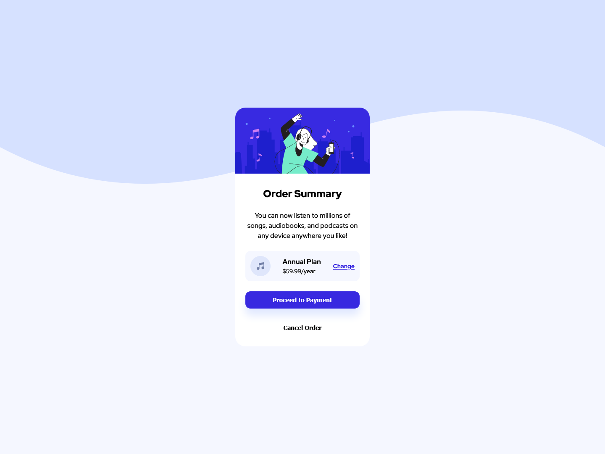

# Frontend Mentor - Order summary card solution

This is a solution to the [Order summary card challenge on Frontend Mentor](https://www.frontendmentor.io/challenges/order-summary-component-QlPmajDUj). Frontend Mentor challenges help you improve your coding skills by building realistic projects. 

## Table of contents

- [Overview](#overview)
  - [The challenge](#the-challenge)
  - [Screenshot](#screenshot)
  - [Links](#links)
- [My process](#my-process)
  - [Built with](#built-with)
  - [What I learned](#what-i-learned)

## Overview

### The challenge

Users should be able to:

- See hover states for interactive elements

### Screenshot



### Links

- Solution URL: [Code](https://your-solution-url.com)
- Live Site URL: [Live Site](https://your-live-site-url.com)

## My process

### Built with

- Semantic HTML5 markup
- CSS custom properties
- Flexbox
- CSS Grid
- Mobile-first workflow

### What I learned

saya menggunakan @media query di dalam css body.

```css
body{
    --gap:1.5rem;
    font-family: var(--ff-red-hat);
    font-size: var(--fs-400);
    font-weight: var(--fw-500);

    background-color: var(--clr-neutral-very-pale-blue);
    background-image: url('images/pattern-background-mobile.svg');

    background-repeat: no-repeat;
    background-size: contain;

    padding: var(--gap);

    min-height: 100vh;
    display: grid;
    justify-content: center;
    align-items: center;
    
    @media(min-width: 38rem){
        background-image: url('images/pattern-background-desktop.svg');
    };
}
```